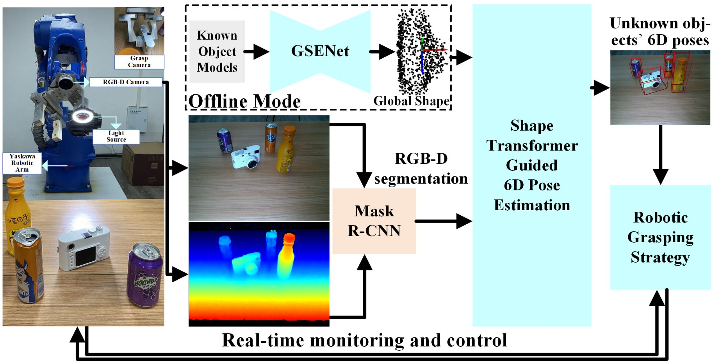

# Robotic Continuous Grasping System by Shape Transformer-Guided Multi-Object Category-Level 6D Pose Estimation
This is the PyTorch implementation of paper **[Robotic Continuous Grasping System by Shape Transformer-Guided Multi-Object Category-Level 6D Pose Estimation](https://ieeexplore.ieee.org/document/10043016)** published in <b>*IEEE Transactions on Industrial Informatics*</b> by <a href="https://cnjliu.github.io/">J. Liu</a>, W. Sun, C. Liu, X. Zhang, and <a href="https://scholar.google.com.hk/citations?user=-FwJwKMAAAAJ&hl=zh-CN&oi=ao">Q. Fu</a>.

<p align="center">

</p>

## Grasping Demo
[https://www.bilibili.com/video/BV16M4y1Q7CD](https://www.bilibili.com/video/BV16M4y1Q7CD) or [https://youtu.be/ZeGN6_DChuA](https://youtu.be/ZeGN6_DChuA)

## Installation
Our code has been tested with
- Ubuntu 20.04
- Python 3.8
- CUDA 11.0
- PyTorch 1.8.0

We recommend using conda to setup the environment.

If you have already installed conda, please use the following commands.

```bash
conda create -n CLGrasp python=3.8
conda activate CLGrasp
conda install ...
```
**Build PointNet++**

```bash
cd 6D-CLGrasp/pointnet2/pointnet2
python setup.py install
```
**Build nn_distance**

```bash
cd 6D-CLGrasp/lib/nn_distance
python setup.py install
```

## Dataset
Download [camera_train](http://download.cs.stanford.edu/orion/nocs/camera_train.zip), [camera_val](http://download.cs.stanford.edu/orion/nocs/camera_val25K.zip),
[real_train](http://download.cs.stanford.edu/orion/nocs/real_train.zip), [real_test](http://download.cs.stanford.edu/orion/nocs/real_test.zip),
[ground-truth annotations](http://download.cs.stanford.edu/orion/nocs/gts.zip),
and [mesh models](http://download.cs.stanford.edu/orion/nocs/obj_models.zip)
provided by [NOCS](https://github.com/hughw19/NOCS_CVPR2019).<br/>
Unzip and organize these files in 6D-CLGrasp/data as follows:
```
data
├── CAMERA
│   ├── train
│   └── val
├── Real
│   ├── train
│   └── test
├── gts
│   ├── val
│   └── real_test
└── obj_models
    ├── train
    ├── val
    ├── real_train
    └── real_test
```
Run python scripts to prepare the datasets.
```
cd 6D-CLGrasp/preprocess
python shape_data.py
python pose_data.py
```

## Evaluation
You can download our pretrained models ([camera](https://drive.google.com/file/d/1bkrA71f2d0xnrIMQefEEkjNL4_e5pi_I/view?usp=share_link), [real](https://drive.google.com/file/d/1MXMHr4YoWrlBxVaf6xnCRFzxCTCtTAqa/view?usp=sharing)) and put them in the '../train_results/CAMERA' and the '../train_results/REAL' directories, respectively. Then, you can have a quick evaluation on the CAMERA25 and REAL275 datasets using the following command. (BTW, the segmentation results '../results/maskrcnn_results' can be download from [SPD](https://github.com/mentian/object-deformnet))
```bash
bash eval.sh
```

## Train
In order to train the model, remember to download the complete dataset, organize and preprocess the dataset properly at first.
```
# optional - train the GSENet and to get the global shapes (the pretrained global shapes can be found in '6D-CLGrasp/assets1')
python train_ae.py
python mean_shape.py
```

train.py is the main file for training. You can simply start training using the following command.
```bash
bash train.sh
```
## Citation
If you find the code useful, please cite our paper.
```latex
@article{TII2023,
  author={Liu, Jian and Sun, Wei and Liu, Chongpei and Zhang, Xing and Fu, Qiang},
  journal={IEEE Transactions on Industrial Informatics},
  title={Robotic Continuous Grasping System by Shape Transformer-Guided Multi-Object Category-Level 6D Pose Estimation},
  year={2023},
  publisher={IEEE},
  doi={10.1109/TII.2023.3244348}
}
```

## Acknowledgment
Our code is developed based on the following repositories. We thank the authors for releasing the codes.
- [Pointnet2.PyTorch](https://github.com/sshaoshuai/Pointnet2.PyTorch);  [SPD](https://github.com/mentian/object-deformnet);  [SGPA](https://github.com/leo94-hk/SGPA);  [MHFormer](https://github.com/Vegetebird/MHFormer)

## Licence

This project is licensed under the terms of the MIT license.
